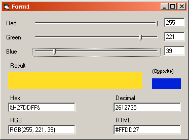



## Colour / Color Tool

### Description

Good little tool. Finds the HEX value, HTML value and DECIMAL value of any colour. See screenshot. Yet another tool I made for saving me time at work because I was always looking for the HTML and HEX codes for using in various projects.
 
### More Info
 

             |
---                |---
**Submitted On**   |2003-12-12 09:09:50
**By**             |[Austin K\. Hayward](https://github.com/Planet-Source-Code/PSCIndex/blob/master/ByAuthor/austin-k-hayward.md)
**Level**          |Advanced
**User Rating**    |4.3 (13 globes from 3 users)
**Compatibility**  |VB 5\.0, VB 6\.0
**Category**       |[Graphics](https://github.com/Planet-Source-Code/PSCIndex/blob/master/ByCategory/graphics__1-46.md)
**World**          |[Visual Basic](https://github.com/Planet-Source-Code/PSCIndex/blob/master/ByWorld/visual-basic.md)
**Archive File**   |[Colour\_\_\_C16830112122003\.zip](https://github.com/Planet-Source-Code/austin-k-hayward-colour-color-tool__1-50420/archive/master.zip)

